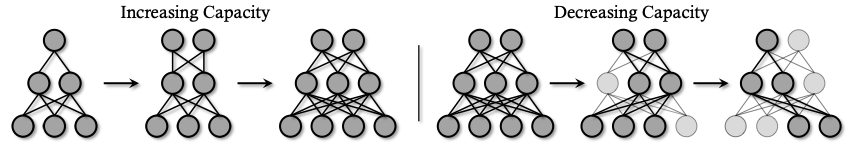

# DynamicD - Improving GANs with A Dynamic Discriminator



> **Improving GANs with A Dynamic Discriminator** <br>
> Ceyuan Yang*, Yujun Shen*, Yinghao Xu, Deli Zhao, Bo Dai, Bolei Zhou <br>
> *arXiv preprint arXiv:2209.09897*

[[Paper](https://arxiv.org/pdf/2209.09897.pdf)]
[[Project Page](https://genforce.github.io/dynamicd/)]

This work aims at adjusting the capacity of a discriminator on-the-fly to better accommodate the time-varying bi-classification task. A comprehensive empirical study confirms that the proposed training strategy, termed as DynamicD, improves the synthesis performance without incurring any additional computation cost or training objectives. Two capacity adjusting schemes are developed for training GANs under different data regimes: i) given a sufficient amount of training data, the discriminator benefits from a progressively increased learning capacity, and ii) when the training data is limited, gradually decreasing the layer width mitigates the over-fitting issue of the discriminator. Experiments on both 2D and 3D-aware image synthesis tasks conducted on a range of datasets substantiate the generalizability of our DynamicD as well as its substantial improvement over the baselines. Furthermore, DynamicD is synergistic to other discriminator-improving approaches (including data augmentation, regularizers, and pre-training), and brings continuous performance gain when combined for learning GANs. 


## Qualitative results
Here we provide synthesis with corresponding FID. Numbers in blue highlight the improvements over baselines.


## BibTeX

```bibtex
@article{yang2022improving,
  title   = {Improving GANs with A Dynamic Discriminator},
  author  = {Yang, Ceyuan and Shen, Yujun and Xu, Yinghao and Zhao, Deli and Dai, Bo and Zhou, Bolei},
  article = {arXiv preprint arXiv:2209.09897},
  year    = {2022}
}
```
